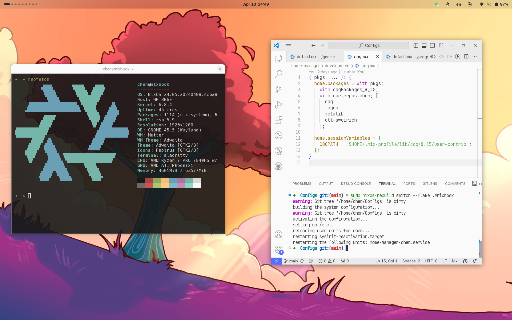
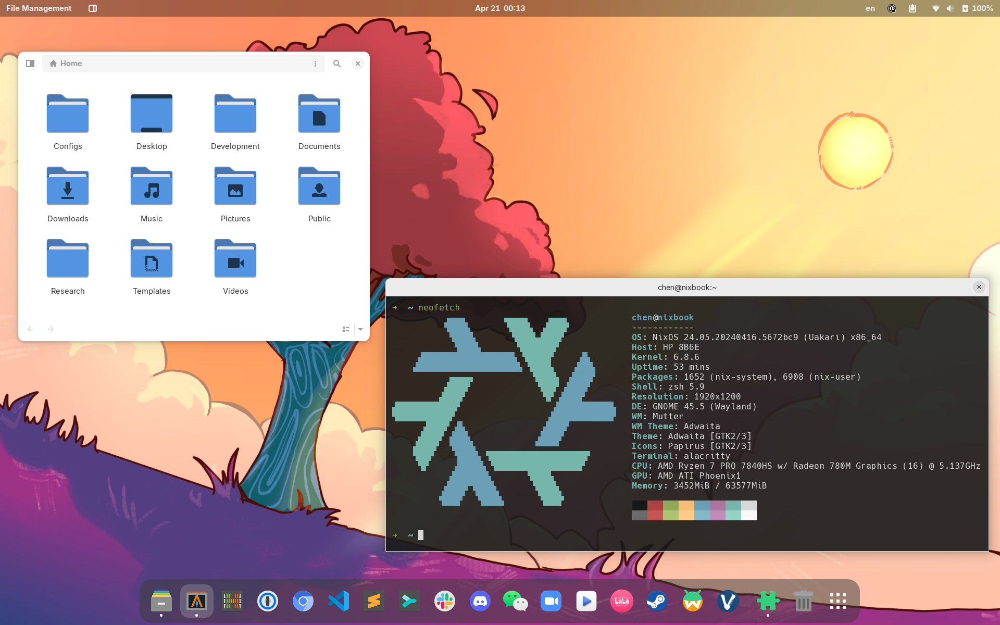
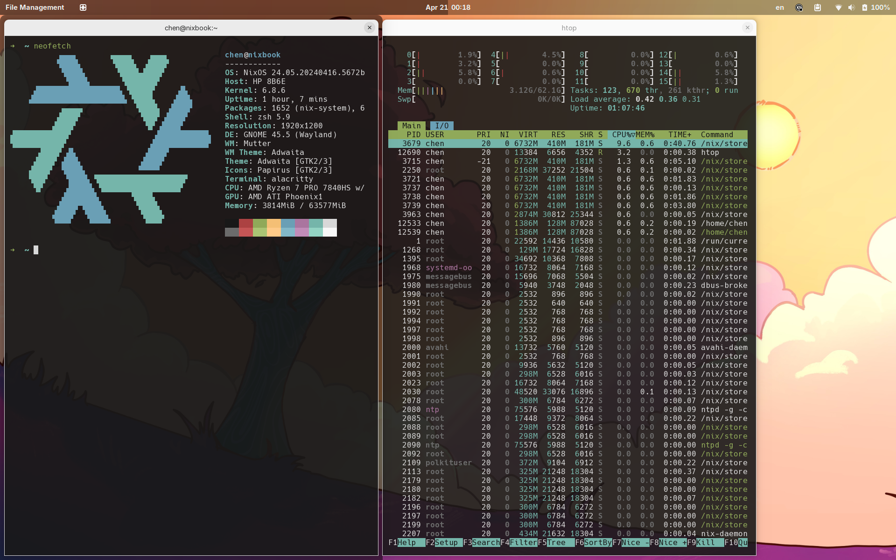
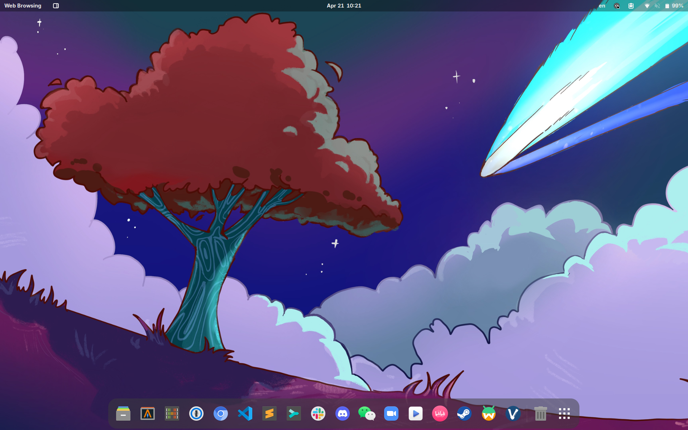
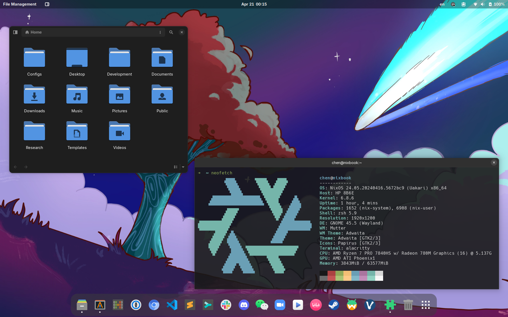
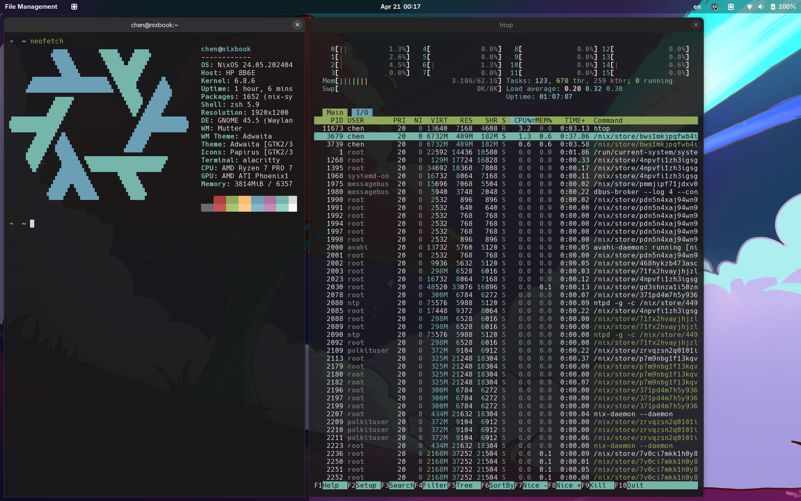

[](https://builtwithnix.org)
[](https://chen.cachix.org)

<p align="center">
  
</p>

<h2 align="center">NixBook: Chen's NixOS Configuration</h2>

These files configure NixOS and Home Manager for Chen's HP EliteBook 865 G10.
The default Nixpkgs branch is `nixos-unstable`. GNOME is the desktop environment.

## Design

- The `/` and `/home` directories use tmpfs. Each boot restores their declarative state.
- The encrypted ext4 filesystem is mounted at `/persist`.
- Bind mounts keep `/nix`, `/var/log`, `/tmp`, and `/swap` on the persistent filesystem.
- Disko creates a GPT, a 1 GiB ESP, a LUKS container, ext4, and a 32 GiB swap file.
- [Impermanence] defines the data that persists across reboots.
- One flake manages NixOS and Home Manager.

## Before installation

CAUTION: The installer erases the complete target disk. Back up all required data before you run it.

These files contain the hardware configuration for the EliteBook 865 G10.
If you use different hardware, replace [`nixos/hardware.nix`](nixos/hardware.nix) first.
Then examine the user, disk, and persistence configuration.

Boot the NixOS installer in UEFI mode. Connect the computer to the network.
Then run these commands:

```console
git clone https://github.com/cu1ch3n/nixbook.git
cd nixbook

test -d /sys/firmware/efi/efivars
lsblk -o NAME,PATH,SIZE,MODEL,SERIAL,TYPE,MOUNTPOINTS
ls -l /dev/disk/by-id/
```

If `test -d /sys/firmware/efi/efivars` fails, restart the installer in UEFI mode.
Disable Secure Boot in the firmware. This configuration does not sign its boot files.
The installer makes sure that UEFI is active and Secure Boot is disabled before disk erasure.

## Installation

The configuration includes `texliveFull`, Haskell, Wine, and many desktop applications.
With the current lock file, the dry run downloads approximately 11 GiB.
It uses approximately 35 GiB in the Nix store.
Make sure that the installer has sufficient space in `/nix/store`.
The installer builds the exact system before it erases the disk.
A build or space failure occurs before disk erasure.

Replace the example path with the stable path for the complete target disk:

```console
./scripts/install.sh /dev/disk/by-id/nvme-EXAMPLE
```

The installer does these operations:

1. It accepts only a direct whole-disk link under `/dev/disk/by-id/`.
2. It records the path, size, serial number, WWN, and device number.
3. It rejects small, mounted, mapped, open, or active swap devices.
4. It rejects label conflicts and detected LVM, Linux RAID, or ZFS members.
5. It makes sure that UEFI, Secure Boot, and the EFI variable filesystem are safe.
6. It stores an immutable flake snapshot under a garbage-collection root.
7. It uses Disko `--dry-run` to build the system and partition script without disk changes.
8. It makes sure that the disk has space for the system, swap, and free-space margin.
9. It reads the root, `chen`, and LUKS passwords twice.
10. It makes sure that the disk identity is unchanged and shows the complete device tree.
11. It requires the exact text `ERASE /dev/disk/by-id/...` before disk erasure.
12. Disko partitions the disk, copies the password hashes and machine ID, and installs NixOS.

Disconnect all disks that are not the installation media or the target disk.
This action prevents ambiguous labels, mappings, and multi-device filesystems.

After installation, restart the computer and remove the installation media.

## First boot

Complete these local operations after the first boot:

- Enroll a fingerprint with `fprintd-enroll`.
- Sign in to 1Password. Then enable its SSH agent and CLI integration.
- Sign in to Mullvad, GitHub, and other account-based applications.
- If you use Doom Emacs, clone and install its configuration.

## Maintenance

Evaluate the configuration without a build:

```console
just check
```

Apply the configuration:

```console
just rebuild
```

Update all unstable inputs. Then evaluate the configuration:

```console
just update
just check
```

Codex is the only package that tracks `nixpkgs/master`.
All other NixOS and Home Manager packages use `nixos-unstable`.
Update only the Codex source. Then evaluate and apply the configuration:

```console
just update-codex
just check
just rebuild
```

Nix installs Codex declaratively. The `flake.lock` file pins its version.

Read the `nixos-unstable` and Home Manager release notes before an update.

## Personal configuration

- [`scripts/disko.nix`](scripts/disko.nix): disk layout, swap size, and tmpfs size.
- [`nixos/hardware.nix`](nixos/hardware.nix): hardware configuration for this computer.
- [`nixos/user.nix`](nixos/user.nix): user name, groups, and local accounts.
- [`nixos/secrets.nix`](nixos/secrets.nix): declarations for private files.
- [`home-manager/home.nix`](home-manager/home.nix): Home Manager user information.
- [`home-manager/programs/git.nix`](home-manager/programs/git.nix): Git identity.

The repository contains two local packages: [`quartz`](pkgs/quartz.nix) and [`hapi`](pkgs/hapi.nix).
The research environment installs Abella from NUR and the OCaml and opam build tools.
It does not install the Rocq, Coq, LNGen, or Ott executables globally.
The Ott configuration only enables its VS Code extension.
NUR contains the custom [`abella-modded`] and [`ott-sweirich`] packages.

## Preview

### Light





### Dark





[`abella-modded`]: https://github.com/nix-community/nur-combined/tree/master/repos/chen/pkgs/abella-modded/default.nix
[Impermanence]: https://github.com/nix-community/impermanence
[`ott-sweirich`]: https://github.com/nix-community/nur-combined/tree/master/repos/chen/pkgs/ott-sweirich/default.nix
[tmpfs as home]: https://elis.nu/blog/2020/06/nixos-tmpfs-as-home/
[tmpfs as root]: https://elis.nu/blog/2020/05/nixos-tmpfs-as-root/
