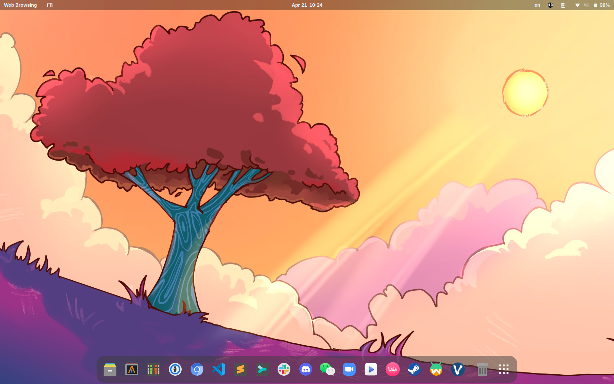

[](https://builtwithnix.org)
[](https://chen.cachix.org)

<p align="center">
    
</p>

<h2 align="center">
    NixBook: Chen's NixOS Configurations
</h2>

> Welcome to NixBook, a repository where I share my NixOS and home-manager configuration files for my EliteBook 865 G10.

## Highlights

- **Tmpfs as root & home**: Automatically erases the root (`/`) and home (`/home`) on each boot, ensuring a clean state. Persistent data is managed by the [Impermanence] module (See [tmpfs as root] and [tmpfs as home] for more details).
- **Encrypted single Btrfs partition**: LUKS enhances security by adding password protection to the disk. Btrfs also supports easy snapshot backups.
- **Declarative disk partitioning**: eliminates the need for manual partitioning, mounting, and unmounting during the installation phase
- **Efficient Desktop Environment**: Optimized for productivity with minimal distractions, featuring only essential visual elements. It supports an automatic switch between light and dark themes.
- **Theorem proving toolchains in PL research**: `abella`, `coq`, `lngen` and `ott` toolchain stuff. Packages maintained by me:
    - `nixpkgs`: [`lngen`]
    - [`nur.repos.chen`]: forked version of `abella` ([`abella-modded`]) and `ott` ([`ott-sweirich`])

## Installation

To install the Nixbook configurations on your system, start by booting your computer with a LiveCD. Once you have successfully booted into the LiveCD environment, open a terminal and enter:

```console
git clone https://github.com/cu1ch3n/nixbook
cd nixbook/script
chmod +x ./install.sh
./install.sh
```

**Note**: If you are not me and your hardware is not `EliteBook 865 G10`, please don't run use `./install.sh` and use the configuration directly. You may want to create your settings based on mine and have to replace some of the configurations. There are several very personal places and you may need to look at:
- `scripts/disko.nix`: you may want to change the disk device and partitions, and the path of the passwordFiles
- `nixos/hardware.nix`: you can generate an initial hardware setting by `nixos-generate-config` and replace the settings accrodingly and **carefully**
- `nixos/user.nix`: I guess your name is not Chen
- `nixos/secrets.nix`: please change the username
- `home-manager/home.nix`: please change the username
- `home-manager/dotfiles/default.nix`: you may commnet out the configuration, unless you use the same monitor as mine
- `home-manager/programs/git.nix`: Your git settings

## Post-installation

After the installation, there are a few settings that need to be configured manually. These settings are not managed declaratively through NixOS:
- Set user fingerprint
- 1Password SSH & CLI integration

## Rebuild NixOS configuration

```console
just rebuild
```

## Update flake lock file

```console
just update
```

## Preview

### Light



### Dark


[`abella-modded`]: https://github.com/nix-community/nur-combined/tree/master/repos/chen/pkgs/abella-modded/default.nix
[`ott-sweirich`]: https://github.com/nix-community/nur-combined/tree/master/repos/chen/pkgs/ott-sweirich/default.nix
[`lngen`]: https://github.com/NixOS/nixpkgs/blob/master/pkgs/by-name/ln/lngen/package.nix
[`nur.repos.chen`]: https://nur.nix-community.org/repos/chen/
[Impermanence]: https://github.com/nix-community/impermanence
[tmpfs as root]: https://elis.nu/blog/2020/05/nixos-tmpfs-as-root/
[tmpfs as home]: https://elis.nu/blog/2020/06/nixos-tmpfs-as-home/
